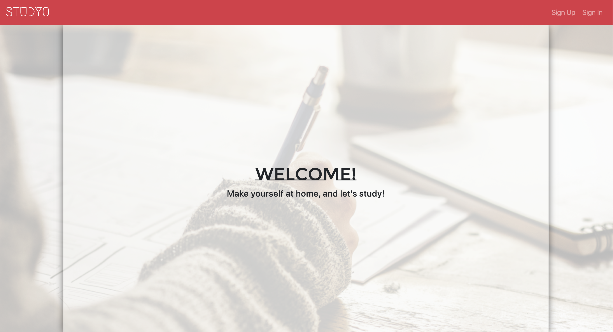
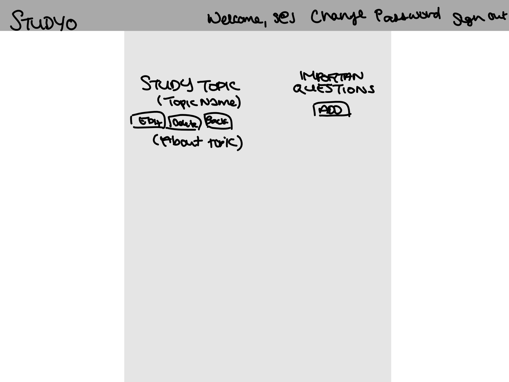
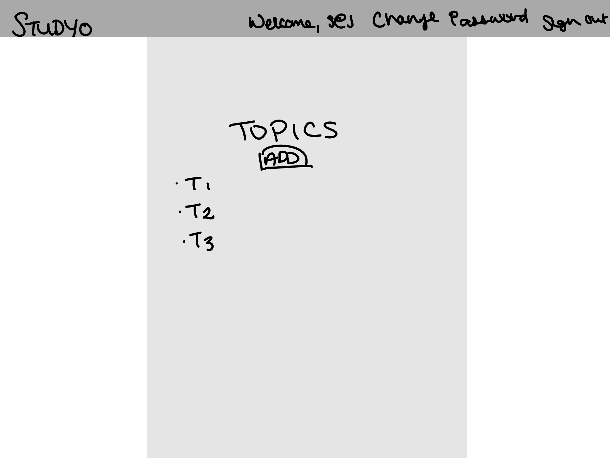

# STUDYO

## Let's Study Together

Exam? Presentation? Interview? Just thirsty for knowledge? You can head over to the **STUDYO**! This application allows users to contribute to or learn from a body of knowledge synthesized by _YOU_! Users must create an account or sign in access the Studyo where they are able to create, edit, and delete topics to study. Each topic contains questions to study. Think flash cards, but digital.

**STUDYO**'s front end is React.js based. Axios is used to interact with the API. Layout and styling utilizes the Twitter's Boostrap library and SASS.

This is Studyo's front end repository. To view the repository for the Studyo API, click [here](https://github.com/stanjng/studyo-backend).

## Links
- [Deployed Application](https://stanjng.github.io/studyo-frontend/)
- [Deployed API via Heroku](https://aqueous-crag-04598.herokuapp.com/)
- [Studyo API](https://stanjng.github.io/studyo-backend/)

## Technologies
- Axios
- Bootstrap
- Postman
- React.js
- SASS

## The Deployed **STUDYO**

## Setup
1. Fork & Clone or download this repository.
1. Install dependencies with `npm install`
1. Run local client with `npm run start`.

## Planning and Development
React utilizes many different snippets of code, called components, that comprises of Javascript and JSX (HTML/Javascript hybrid) syntax. These components can be reused and reporposed on different webpages, e.g. a text box form that is used for both create and edit functions.

The first step was to create the different routes and links that trigger a rerendering of a specific component to display.

Next, I created a new components for each CRUD function along wit a splash page.

Finally, I ensured each component displays properly and is functional. Style was done along each stop of the sode.

Troubleshoot assistance obtained from GA's SEI instructional team.

## User Stories
#### When signed out:
- As a user, I want to be brought to a sign up and sign in page with forms upon clicking a button only available when signed out.
- As a user, I want to be authenticated with an email and a password.

#### When signed in:
- As a user, I want to be brought to a change password form when clicking a button on the nav bar.
- As a user, I want to be signed out of the application upon clicking a button on the nav bar.
- As a user, I want to have my NavBar present at all times.
- As a user, I want to create a new topic/question.
- As a user, I want to retrieve all of my topic/questions to view.
- As a user, I want to retrieve just one topic/question to view.
- As a user, I want to edit the topic/question name and descriptions.
- As a user, I want to delete a topic/question.

## Wireframes

Unauthorized

Authorized

## Future Directions
- Privacy feature so users have the option to make private vs public topics.
- Documents/pdf upload feature into each topic.
- Search feature to find specific topics.
- Include date tags.
- Sort feature.
- Implement tags to specify related topics.

## Acknowledgements

Thank you to my instructors, fellow software engineer classmates, and friends who keep me grounded and driven.
